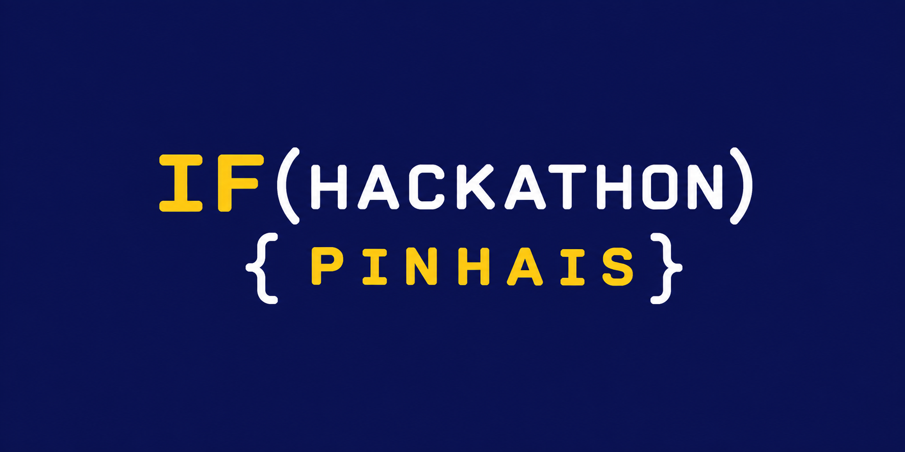

[](https://hackathon-ifpr.up.railway.app/)

# Hackathon IFPR Pinhais - [Website do projeto](https://hackathon-ifpr.up.railway.app/)

Sistema de apoio ao 1º Hackathon do curso de Ciência da Computação do IFPR Campus Pinhais, desenvolvido como projeto integrador da disciplina **Engenharia de Software I**.

O sistema cobre todo o ciclo do evento: inscrição de equipes, verificação automatizada de legitimidade das submissões via GitHub, avaliação pela banca examinadora e divulgação pública dos resultados.

📄 Para decisões de design mais detalhadas, consulte a [Wiki do projeto](../../wiki).

---

### Tecnologias e Ferramentas

#### Backend & Frameworks


#### Banco de Dados


#### Frontend


#### Serviços & Integrações


---

## Como rodar localmente

```bash
# clonar o repositório
git clone https://github.com/juliastrobel/Projeto_Final_Hackathon_Engenharia_de_Software.git
cd Projeto_Final_Hackathon_Engenharia_de_Software

# criar e ativar o ambiente virtual
python3 -m venv venv
source venv/bin/activate

# instalar as dependências
pip install -r requirements.txt

# configurar as variáveis de ambiente
cp .env.example .env
# preencher o .env com os valores reais

# rodar a aplicação
uvicorn app.main:app --reload
```

Acesse `http://localhost:8000` no navegador.

---

## Equipe

- **regra de negócio, APIs, banco de dados e servidor.**: Isaque Cortina Pires
- **design visual, telas, navegação e consumo das APIs**: Julia Pinheiro Strobel

---

## Licença

Este projeto está licenciado sob os termos da licença MIT.
